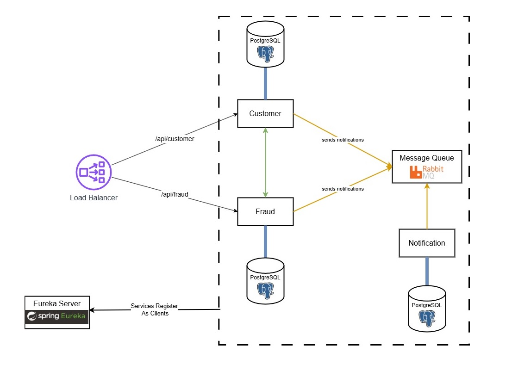

## Project Overview



This project is a microservices-based application built using Java, Spring Boot, and Maven. It consists of several modules, each serving a specific purpose. The modules communicate with each other using REST APIs and messaging queues.

### Modules

1. **Customer Module**
    - **Description**: Manages customer-related operations.
    - **Communication**: Communicates with the Fraud and Notification modules via REST APIs and RabbitMQ for messaging.

2. **Fraud Module**
    - **Description**: Handles fraud detection for customer transactions.
    - **Communication**: Receives customer data from the Customer module and sends notifications to the Notification module.

3. **Notification Module**
    - **Description**: Sends notifications to customers.
    - **Communication**: Receives messages from the Fraud and Customer modules via RabbitMQ.

4. **Eureka Server**
    - **Description**: Service registry for managing microservices.
    - **Communication**: All modules register with the Eureka server for service discovery.

5. **API Gateway (apigw)**
    - **Description**: Acts as a gateway for routing requests to the appropriate microservices.
    - **Communication**: Routes external requests to the Customer, Fraud, and Notification modules.

6. **Postgres**
    - **Description**: Database service for storing application data.
    - **Communication**: Used by the Customer, Fraud, and Notification modules for data persistence.

7. **RabbitMQ**
    - **Description**: Message broker for asynchronous communication between microservices.
    - **Communication**: Used by the Customer, Fraud, and Notification modules for sending and receiving messages.

8. **Zipkin**
    - **Description**: Distributed tracing system for monitoring and troubleshooting microservices.
    - **Communication**: Integrated with all modules to trace requests.

9. **PgAdmin**
    - **Description**: Database management tool for Postgres.
    - **Communication**: Used for managing the Postgres database.

### Communication Flow

- **Customer Module**: Sends customer data to the Fraud module for fraud detection. If fraud is detected, the Fraud module sends a notification to the Notification module.
- **Fraud Module**: Receives customer data from the Customer module and processes it for fraud detection. Sends notifications to the Notification module if fraud is detected.
- **Notification Module**: Receives messages from the Fraud and Customer modules and sends notifications to customers.
- **Eureka Server**: All modules register with the Eureka server for service discovery.
- **API Gateway**: Routes external requests to the appropriate microservices.
- **RabbitMQ**: Facilitates asynchronous communication between the Customer, Fraud, and Notification modules.
- **Zipkin**: Traces requests across all modules for monitoring and troubleshooting.

### Running the Project

To run the project, use the `docker-compose.yml` file to start all the services:

```sh
docker-compose up
```

This will start all the modules, including the database, message broker, and tracing system.

### Accessing Services

To register a customer, you can use swagger-ui to interact with the Customer module:

http://localhost:8080/swagger-ui.html#/customer-controller

You can access the Postgres database using PgAdmin:

http://localhost:5050

The Eureka server dashboard can be accessed at:

http://localhost:8761

The Zipkin dashboard can be accessed at:

http://localhost:9411

RabbitMQ management UI can be accessed at:

http://localhost:15672